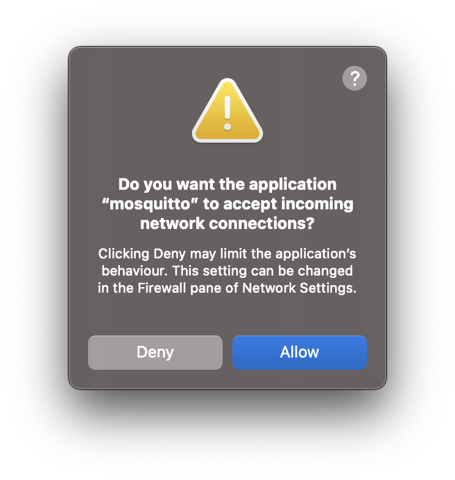

# mqtt-learnings


```
while true; do mosquitto_pub -t topic/state -m "Hello World $(date +'%s')"; sleep 2; done
```

# visualize

* Mac https://mqtt-explorer.com/
* Android https://play.google.com/store/apps/details?id=snr.lab.iotmqttpanel.prod

# setup
```
brew install mosquitto
```

```
mosquitto has been installed with a default configuration file.
You can make changes to the configuration by editing:
    /opt/homebrew/etc/mosquitto/mosquitto.conf

To restart mosquitto after an upgrade:
  brew services restart mosquitto
Or, if you don't want/need a background service you can just run:
  /opt/homebrew/opt/mosquitto/sbin/mosquitto -c /opt/homebrew/etc/mosquitto/mosquitto.conf
```

## docker

https://cedalo.com/blog/mosquitto-docker-configuration-ultimate-guide/

```
docker run -it -d --name mos1 -p 1883:1883 -v /etc/mosquitto/mosquitto.conf:/mosquitto/config/mosquitto.conf eclipse-mosquitto:2
```
or simpler with a local.conf file
```
docker run -it -d --name mos1 -p 1883:1883 -v $(pwd)/local.conf:/mosquitto/config/mosquitto.conf eclipse-mosquitto:2
```
and let´s add node red:
```
docker run -it -p 1880:1880 -v node_red_data:/data --name mynodered nodered/node-red
```
from https://nodered.org/docs/getting-started/docker


# config

```
listener 1883 0.0.0.0
listener 1883 192.168.178.71
allow_anonymous true
```


should trigger:



# iotcloud

```
ArduinoIoTCloudTCP::handle_ConnectMqttBroker could not connect to mqtts-up.iot.arduino.cc:8884
ArduinoIoTCloudTCP::handle_ConnectMqttBroker 7 connection attempt at tick time 1642045
```

## issues
* AK9753 (https://www.sparkfun.com/products/14349) https://github.com/sparkfun/SparkFun_DataLogger/issues/17 
