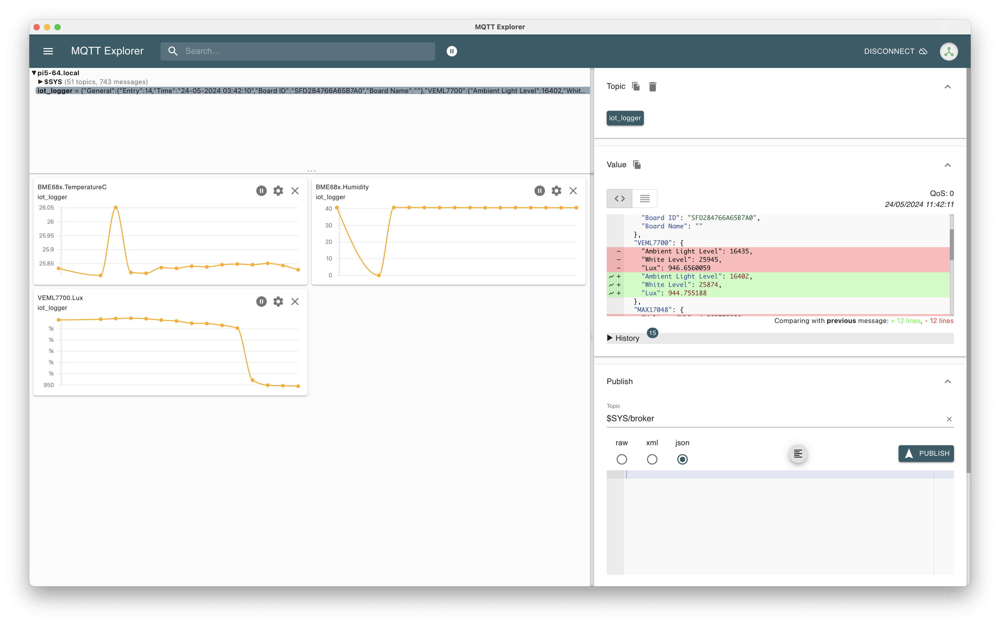

# sparkfun SparkFun_DataLogger

install `CoolTerm` https://freeware.the-meiers.org/ 
* backspace doesn't work ([fix](https://learn.sparkfun.com/tutorials/terminal-basics/coolterm-windows-mac-linux#:~:text=If%20you%27re%20getting%20annoyed%20with%20not%20being%20able%20to%20use%20the%20backspace%2C%20turn%20on%20%27Handle%20Backspace%20Character%27%20under%20the%20Terminal%20tab%20under%20Options.) is not valid anymore)
* press backspace until `...` appears

https://docs.sparkfun.com/SparkFun_DataLogger/configuration/

* server: `pi5-64.local`
* port: `1883`

it works

