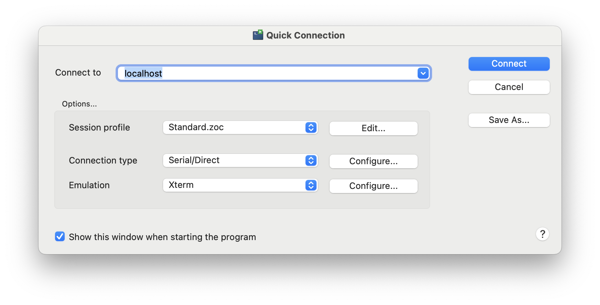

# sparkfun SparkFun_DataLogger

TODO

 * [ ] update to https://github.com/sparkfun/SparkFun_DataLogger/releases/tag/v01.01.99 via SD-card to:
 * [ ] test the https://github.com/sparkfun/SparkFun_DataLogger/issues/18 metadata
 * [ ] keep an eye on presence sensor issue https://github.com/sparkfun/SparkFun_DataLogger/issues/17 

`after firmware update - you need to set all the settings again` - maybe you can save/restore settings...

* install `CoolTerm` https://freeware.the-meiers.org/ 
   * `brew install coolterm`
* backspace doesn't work ([fix](https://learn.sparkfun.com/tutorials/terminal-basics/coolterm-windows-mac-linux#:~:text=If%20you%27re%20getting%20annoyed%20with%20not%20being%20able%20to%20use%20the%20backspace%2C%20turn%20on%20%27Handle%20Backspace%20Character%27%20under%20the%20Terminal%20tab%20under%20Options.) is not valid anymore)
   * press backspace until `...` appears

used https://docs.sparkfun.com/SparkFun_DataLogger/configuration/

* server: `pi5-64.local`
* port: `1883`

`brew install zoc`
* https://www.emtec.com/zoc/index.html
* seems to work with line breaks

it works

